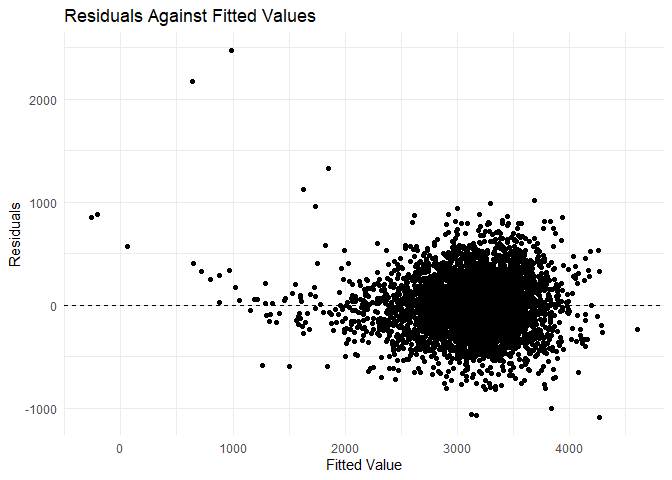
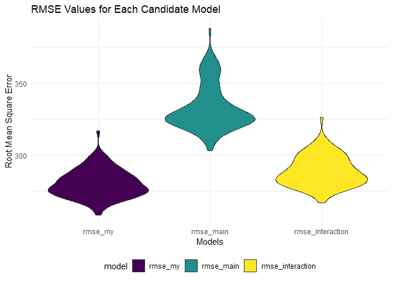

p8105_hw6_td2809
================
Chris Deng
2023-11-30

``` r
knitr::opts_chunk$set(echo = TRUE)

library(tidyverse)
```

    ## ── Attaching core tidyverse packages ──────────────────────── tidyverse 2.0.0 ──
    ## ✔ dplyr     1.1.3     ✔ readr     2.1.4
    ## ✔ forcats   1.0.0     ✔ stringr   1.5.0
    ## ✔ ggplot2   3.4.3     ✔ tibble    3.2.1
    ## ✔ lubridate 1.9.2     ✔ tidyr     1.3.0
    ## ✔ purrr     1.0.2     
    ## ── Conflicts ────────────────────────────────────────── tidyverse_conflicts() ──
    ## ✖ dplyr::filter() masks stats::filter()
    ## ✖ dplyr::lag()    masks stats::lag()
    ## ℹ Use the conflicted package (<http://conflicted.r-lib.org/>) to force all conflicts to become errors

``` r
library(modelr)
library(viridis)
```

    ## 载入需要的程辑包：viridisLite

``` r
# remove the frame and change legend to bottom
theme_set(theme_minimal() + theme(legend.position = "bottom"))  

# change continuous variables with "viridis" for color and fill 
options(
  ggplot2.continuous.colour = "viridis",
  ggplot2.continuous.fill = "viridis"
)

# change discrete variables with "viridis" for color and fill 
scale_colour_discrete = scale_color_viridis_d
scale_fill_discrete = scale_fill_viridis_d
```

# Problem 1

``` r
homicide_df = read_csv("data/homicide-data.csv") |>
  janitor::clean_names() |>
  mutate(city_state = paste(city, state, sep = ", "),
         solved = as_factor(if_else(disposition %in% c("Closed without arrest", "Closed by arrest"), 1, 0)),
         victim_age = as.numeric(victim_age)) |>
  filter(!city_state %in% c("Dallas, TX", "Phoenix, AZ", "Kansas City, MO", "Tulsa, AL"),
         victim_race %in% c("White", "Black"))
```

    ## Rows: 52179 Columns: 12
    ## ── Column specification ────────────────────────────────────────────────────────
    ## Delimiter: ","
    ## chr (9): uid, victim_last, victim_first, victim_race, victim_age, victim_sex...
    ## dbl (3): reported_date, lat, lon
    ## 
    ## ℹ Use `spec()` to retrieve the full column specification for this data.
    ## ℹ Specify the column types or set `show_col_types = FALSE` to quiet this message.

    ## Warning: There was 1 warning in `mutate()`.
    ## ℹ In argument: `victim_age = as.numeric(victim_age)`.
    ## Caused by warning:
    ## ! 强制改变过程中产生了NA

``` r
baltimore_df = homicide_df %>%
  filter(city_state == "Baltimore, MD")

baltimore_glm <- glm(solved ~ victim_age + victim_sex + victim_race, family = binomial, data = baltimore_df)

baltimore_glm |> 
  broom::tidy() |> 
  mutate(
    OR = exp(estimate), 
    OR_CI_upper = exp(estimate + 1.96 * std.error),
    OR_CI_lower = exp(estimate - 1.96 * std.error)) |> 
  filter(term == "victim_sexMale") |> 
  select(OR, OR_CI_lower, OR_CI_upper) |>
  knitr::kable(digits = 3)
```

|    OR | OR_CI_lower | OR_CI_upper |
|------:|------------:|------------:|
| 0.355 |       0.268 |       0.469 |

Now, run `glm` for each of the cities in the dataset, and extract the
adjusted odds ratio (and CI) for solving homicides comparing male
victims to female victims.

``` r
model_results = 
  homicide_df |> 
  nest(data = -city_state) |> 
  mutate(
    models = map(data, \(df) glm(solved ~ victim_age + victim_sex + victim_race, family = binomial(), data = df)),
    tidy_models = map(models, broom::tidy)) |> 
  select(-models, -data) |> 
  unnest(cols = tidy_models) |> 
  mutate(
    OR = exp(estimate), 
    OR_CI_upper = exp(estimate + 1.96 * std.error),
    OR_CI_lower = exp(estimate - 1.96 * std.error)) |> 
  filter(term == "victim_sexMale") |> 
  select(city_state, OR, OR_CI_lower, OR_CI_upper)

model_results |>
  slice(1:5) |> 
  knitr::kable(digits = 3)
```

| city_state      |    OR | OR_CI_lower | OR_CI_upper |
|:----------------|------:|------------:|------------:|
| Albuquerque, NM | 0.430 |       0.148 |       1.253 |
| Atlanta, GA     | 0.512 |       0.328 |       0.799 |
| Baltimore, MD   | 0.355 |       0.268 |       0.469 |
| Baton Rouge, LA | 0.319 |       0.166 |       0.612 |
| Birmingham, AL  | 0.704 |       0.450 |       1.103 |

Create a plot that shows the estimated ORs and CIs for each city.

``` r
ggplot(model_results, aes(x = reorder(city_state, OR), y = OR)) +
  geom_point() +
  geom_errorbar(aes(ymin = OR_CI_lower, ymax = OR_CI_upper), width = 0.25) +
  coord_flip() +  # flip the axes 
  xlab("City") +
  ylab("Odds Ratio") +
  ggtitle("Odds Ratios with CI for Solving Homicides ")
```

<!-- -->

# Problem 2

``` r
weather_df = 
  rnoaa::meteo_pull_monitors(
    c("USW00094728"),
    var = c("PRCP", "TMIN", "TMAX"), 
    date_min = "2022-01-01",
    date_max = "2022-12-31") |>
  mutate(
    name = recode(id, USW00094728 = "CentralPark_NY"),
    tmin = tmin / 10,
    tmax = tmax / 10) |>
  select(name, id, everything())
```

    ## using cached file: C:\Users\邓添元\AppData\Local/R/cache/R/rnoaa/noaa_ghcnd/USW00094728.dly

    ## date created (size, mb): 2023-12-02 19:32:25.68058 (8.561)

    ## file min/max dates: 1869-01-01 / 2023-11-30

``` r
# Define bootstraps function
bootstraps = function(df) {
  sample_frac(df, replace = TRUE)
}

n = 5000

# Generate bootstrap samples
boot_samples = 
  tibble(boot_number = 1:n) |> 
  mutate(
    strap_sample = map(boot_number, \(i) bootstraps(df = weather_df))
  )

# Generate the estimates of interest
bootstrap_results = 
  boot_samples |>
  mutate(
    models = map(strap_sample, \(df) lm(tmax ~ tmin + prcp, data = df)),
    results_tidy = map(models, broom::tidy),
    results_glance = map(models, broom::glance)
  ) |> 
  select(-strap_sample, -models) |> 
  unnest(results_tidy, results_glance) |> 
  select(boot_number, term, estimate, r.squared)
```

    ## Warning: `unnest()` has a new interface. See `?unnest` for details.
    ## ℹ Try `df %>% unnest(c(results_tidy, results_glance))`, with `mutate()` if
    ##   needed.

``` r
# Alternative approach to pivot and mutate the dataset
bootstrap_results_2 = 
  bootstrap_results |> 
  pivot_wider(names_from = term, values_from = estimate) |> 
  mutate(log_product = if_else(tmin * prcp <= 0, NA_real_, log(tmin * prcp)))
```

    ## Warning: There was 1 warning in `mutate()`.
    ## ℹ In argument: `log_product = if_else(tmin * prcp <= 0, NA_real_, log(tmin *
    ##   prcp))`.
    ## Caused by warning in `log()`:
    ## ! 产生了NaNs

``` r
head(bootstrap_results_2)
```

    ## # A tibble: 6 × 6
    ##   boot_number r.squared `(Intercept)`  tmin     prcp log_product
    ##         <int>     <dbl>         <dbl> <dbl>    <dbl>       <dbl>
    ## 1           1     0.911          8.12 1.01   0.00218       -6.12
    ## 2           2     0.902          7.90 0.991  0.00446       -5.42
    ## 3           3     0.920          8.10 1.02  -0.00378       NA   
    ## 4           4     0.941          7.75 1.03  -0.00619       NA   
    ## 5           5     0.923          8.24 0.998 -0.00459       NA   
    ## 6           6     0.933          8.21 1.02  -0.00571       NA

``` r
bootstrap_results_2 |>
  ggplot(aes(x = r.squared)) +
  geom_histogram(bins = 30, fill = "blue", color = "black") +
  labs(title = "Distribution of R-squared Estimates", x = "R-squared", y = "Frequency")
```

<!-- -->

``` r
bootstrap_results_2 |>
  ggplot(aes(x = log_product)) +
  geom_histogram(bins = 30, fill = "darkred", color = "black") +
  labs(title = "Distribution of log(beta1 * beta2) Estimates", 
       x = "log(beta1 * beta2)", y = "Frequency")
```

    ## Warning: Removed 3420 rows containing non-finite values (`stat_bin()`).

<!-- -->
From Fig.1 we observe that the distribution of $\hat{r}^{2}$ is
approximates the normal distribution and is approximately symmetric
about 0.91. Fig.2 displays the distribution of
$log(\hat{\beta _{1}}\times\hat{\beta _{2}})$, which exhibits a
left-skewed bell-shaped curve, peaking around -5.5.

``` r
# Calculate 95% confidence intervals for r^2 and log_product estimates
ci_95 = 
  bootstrap_results_2 |>
  summarize(
    lower_ci = c(quantile(r.squared, 0.025, na.rm = TRUE),
                 quantile(log_product, 0.025, na.rm = TRUE)),
    upper_ci = c(quantile(r.squared, 0.975, na.rm = TRUE),
                 quantile(log_product, 0.975, na.rm = TRUE))
  ) |> 
  mutate(quantity_type = c("r_squared", "log_product")) |>  
  select(quantity_type, lower_ci, upper_ci) 
```

    ## Warning: Returning more (or less) than 1 row per `summarise()` group was deprecated in
    ## dplyr 1.1.0.
    ## ℹ Please use `reframe()` instead.
    ## ℹ When switching from `summarise()` to `reframe()`, remember that `reframe()`
    ##   always returns an ungrouped data frame and adjust accordingly.
    ## Call `lifecycle::last_lifecycle_warnings()` to see where this warning was
    ## generated.

``` r
# Display the confidence intervals in a table format
ci_95 |> 
  knitr::kable(digits = 3)
```

| quantity_type | lower_ci | upper_ci |
|:--------------|---------:|---------:|
| r_squared     |    0.890 |    0.940 |
| log_product   |   -8.954 |   -4.617 |

- The 95% CI for $\hat{r}^2$ is (0.89, 0.94)
- The 95% CI for $\log(\hat{\beta}_1 \times \hat{\beta}_2)$ is (-8.954,
  -4.617)

# Problem 3

Load and clean the data for regression analysis

``` r
#load and tidy the data
birthweight_df = 
  read_csv("data/birthweight.csv") |>
  janitor::clean_names() |>
  mutate(
    babysex = as.factor(babysex),
    frace = as.factor(frace),
    malform = as.factor(malform),
    mrace = as.factor(mrace)
  ) |>
  drop_na()
```

    ## Rows: 4342 Columns: 20
    ## ── Column specification ────────────────────────────────────────────────────────
    ## Delimiter: ","
    ## dbl (20): babysex, bhead, blength, bwt, delwt, fincome, frace, gaweeks, malf...
    ## 
    ## ℹ Use `spec()` to retrieve the full column specification for this data.
    ## ℹ Specify the column types or set `show_col_types = FALSE` to quiet this message.

The birth weight of infants can be influenced by various factors related
to the baby’s physique, gestational age, health status, and the mother’s
physical condition and lifestyle. Therefore, I have selected a range of
predictors to forecast birth weight. These include `bhead`, `blength`,
`gaweeks`, `delwt`, `mheight`, `momage`, `ppwt`, `smoken`.

``` r
birthweight_MLR = 
  birthweight_df |>
  lm(bwt ~ bhead + blength + gaweeks + delwt + mheight + momage  + ppwt + smoken, data = _)
summary(birthweight_MLR)
```

    ## 
    ## Call:
    ## lm(formula = bwt ~ bhead + blength + gaweeks + delwt + mheight + 
    ##     momage + ppwt + smoken, data = birthweight_df)
    ## 
    ## Residuals:
    ##      Min       1Q   Median       3Q      Max 
    ## -1087.66  -186.09    -7.08   176.35  2469.15 
    ## 
    ## Coefficients:
    ##               Estimate Std. Error t value Pr(>|t|)    
    ## (Intercept) -6667.7607   133.6084 -49.905  < 2e-16 ***
    ## bhead         133.6152     3.4742  38.459  < 2e-16 ***
    ## blength        77.2666     2.0632  37.450  < 2e-16 ***
    ## gaweeks        13.4278     1.4866   9.033  < 2e-16 ***
    ## delwt           3.9765     0.4039   9.846  < 2e-16 ***
    ## mheight         9.1277     1.7869   5.108 3.39e-07 ***
    ## momage          6.3045     1.1237   5.611 2.14e-08 ***
    ## ppwt           -2.9372     0.4425  -6.637 3.59e-11 ***
    ## smoken         -2.7122     0.5794  -4.681 2.94e-06 ***
    ## ---
    ## Signif. codes:  0 '***' 0.001 '**' 0.01 '*' 0.05 '.' 0.1 ' ' 1
    ## 
    ## Residual standard error: 279.6 on 4333 degrees of freedom
    ## Multiple R-squared:  0.7025, Adjusted R-squared:  0.7019 
    ## F-statistic:  1279 on 8 and 4333 DF,  p-value: < 2.2e-16

``` r
# plot of residuals against fitted values
birthweight_df |>
  add_predictions(birthweight_MLR) |>
  add_residuals(birthweight_MLR) |>
  ggplot(aes(x = pred, y = resid)) +
  geom_point() +
  geom_hline(yintercept = 0, linetype = "dashed") +
  labs(x = ("Fitted Value"),y = ("Residuals"), title = "Residuals Against Fitted Values")
```

<!-- -->

``` r
# Creating training and testing data
cv_df = crossv_mc(birthweight_df, 100)

# Fit data to three models and compare RMSE
cv_df = cv_df |>
  mutate(
    my_mod = map(train, \(df) lm(bwt ~ bhead + blength + gaweeks + delwt + mheight + momage  + ppwt + smoken, data = df)),
    main_mod = map(train, \(df) lm(bwt ~ blength + gaweeks, data = df)),
    interaction_mod = map(train, \(df) lm(bwt ~ bhead * blength * babysex, data = df))
  ) |>
  mutate(
    rmse_my = map2_dbl(my_mod, test, \(mod, df) rmse(model = mod, data = df)),
    rmse_main = map2_dbl(main_mod, test, \(mod, df) rmse(model = mod, data = df)),
    rmse_interaction = map2_dbl(interaction_mod, test, \(mod, df) rmse(model = mod, data = df))
  )

cv_df |>
  select(starts_with("rmse")) |>
  pivot_longer(
    everything(),
    names_to = "model",
    values_to = "rmse"
  ) |>
  mutate(model = fct_inorder(model)) |>
  ggplot(aes(x = model, y = rmse, fill = model)) +
  geom_violin() +
  labs(title = "RMSE Values for Each Candidate Model",
       x = "Models", 
       y = "Root Mean Square Error")
```

<!-- -->
The data suggests that my model demonstrates the lowest RMSE, implying a
superior fit to the data compared to the other two models. Conversely,
the model solely incorporating the main effects of birth length and
gestational age as predictors of birth weight exhibits the highest RMSE.
This may indicate its relatively inferior performance in accurately
predicting birth weight.
