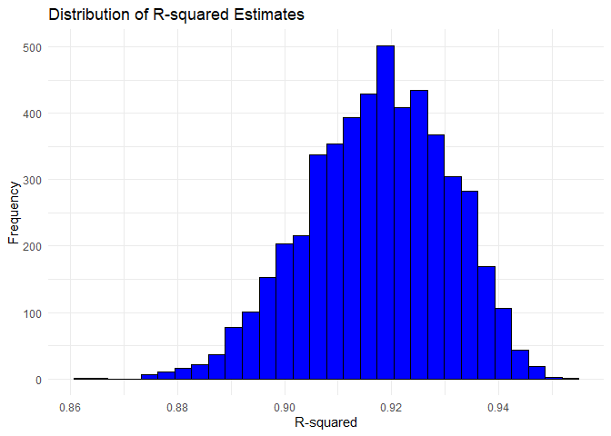
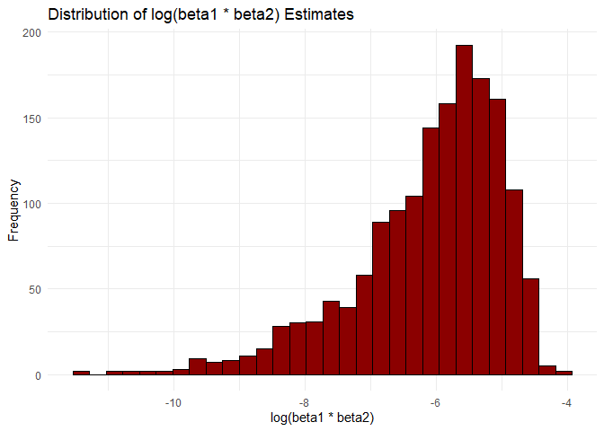

p8105_hw6_td2809
================
Chris Deng
2023-11-30

``` r
knitr::opts_chunk$set(echo = TRUE)

library(tidyverse)
```

    ## ── Attaching core tidyverse packages ──────────────────────── tidyverse 2.0.0 ──
    ## ✔ dplyr     1.1.3     ✔ readr     2.1.4
    ## ✔ forcats   1.0.0     ✔ stringr   1.5.0
    ## ✔ ggplot2   3.4.3     ✔ tibble    3.2.1
    ## ✔ lubridate 1.9.2     ✔ tidyr     1.3.0
    ## ✔ purrr     1.0.2     
    ## ── Conflicts ────────────────────────────────────────── tidyverse_conflicts() ──
    ## ✖ dplyr::filter() masks stats::filter()
    ## ✖ dplyr::lag()    masks stats::lag()
    ## ℹ Use the conflicted package (<http://conflicted.r-lib.org/>) to force all conflicts to become errors

``` r
library(modelr)
library(viridis)
```

    ## 载入需要的程辑包：viridisLite

``` r
# remove the frame and change legend to bottom
theme_set(theme_minimal() + theme(legend.position = "bottom"))  

# change continuous variables with "viridis" for color and fill 
options(
  ggplot2.continuous.colour = "viridis",
  ggplot2.continuous.fill = "viridis"
)

# change discrete variables with "viridis" for color and fill 
scale_colour_discrete = scale_color_viridis_d
scale_fill_discrete = scale_fill_viridis_d
```

# Problem 1

``` r
homicide_df = read_csv("data/homicide-data.csv") |>
  janitor::clean_names() |>
  mutate(city_state = paste(city, state, sep = ", "),
         solved = as_factor(if_else(disposition %in% c("Closed without arrest", "Closed by arrest"), 1, 0)),
         victim_age = as.numeric(victim_age)) |>
  filter(!city_state %in% c("Dallas, TX", "Phoenix, AZ", "Kansas City, MO", "Tulsa, AL"),
         victim_race %in% c("White", "Black"))
```

    ## Rows: 52179 Columns: 12
    ## ── Column specification ────────────────────────────────────────────────────────
    ## Delimiter: ","
    ## chr (9): uid, victim_last, victim_first, victim_race, victim_age, victim_sex...
    ## dbl (3): reported_date, lat, lon
    ## 
    ## ℹ Use `spec()` to retrieve the full column specification for this data.
    ## ℹ Specify the column types or set `show_col_types = FALSE` to quiet this message.

    ## Warning: There was 1 warning in `mutate()`.
    ## ℹ In argument: `victim_age = as.numeric(victim_age)`.
    ## Caused by warning:
    ## ! 强制改变过程中产生了NA

``` r
baltimore_df = homicide_df %>%
  filter(city_state == "Baltimore, MD")

baltimore_glm <- glm(solved ~ victim_age + victim_sex + victim_race, family = binomial, data = baltimore_df)

baltimore_glm |> 
  broom::tidy() |> 
  mutate(
    OR = exp(estimate), 
    OR_CI_upper = exp(estimate + 1.96 * std.error),
    OR_CI_lower = exp(estimate - 1.96 * std.error)) |> 
  filter(term == "victim_sexMale") |> 
  select(OR, OR_CI_lower, OR_CI_upper) |>
  knitr::kable(digits = 3)
```

|    OR | OR_CI_lower | OR_CI_upper |
|------:|------------:|------------:|
| 0.355 |       0.268 |       0.469 |

Now, run `glm` for each of the cities in the dataset, and extract the
adjusted odds ratio (and CI) for solving homicides comparing male
victims to female victims.

``` r
model_results = 
  homicide_df |> 
  nest(data = -city_state) |> 
  mutate(
    models = map(data, \(df) glm(solved ~ victim_age + victim_sex + victim_race, family = binomial(), data = df)),
    tidy_models = map(models, broom::tidy)) |> 
  select(-models, -data) |> 
  unnest(cols = tidy_models) |> 
  mutate(
    OR = exp(estimate), 
    OR_CI_upper = exp(estimate + 1.96 * std.error),
    OR_CI_lower = exp(estimate - 1.96 * std.error)) |> 
  filter(term == "victim_sexMale") |> 
  select(city_state, OR, OR_CI_lower, OR_CI_upper)

model_results |>
  slice(1:5) |> 
  knitr::kable(digits = 3)
```

| city_state      |    OR | OR_CI_lower | OR_CI_upper |
|:----------------|------:|------------:|------------:|
| Albuquerque, NM | 0.430 |       0.148 |       1.253 |
| Atlanta, GA     | 0.512 |       0.328 |       0.799 |
| Baltimore, MD   | 0.355 |       0.268 |       0.469 |
| Baton Rouge, LA | 0.319 |       0.166 |       0.612 |
| Birmingham, AL  | 0.704 |       0.450 |       1.103 |

Create a plot that shows the estimated ORs and CIs for each city.

``` r
ggplot(model_results, aes(x = reorder(city_state, OR), y = OR)) +
  geom_point() +
  geom_errorbar(aes(ymin = OR_CI_lower, ymax = OR_CI_upper), width = 0.25) +
  coord_flip() +  # flip the axes 
  xlab("City") +
  ylab("Odds Ratio") +
  ggtitle("Odds Ratios with CI for Solving Homicides ")
```

<!-- --> \#
Problem 2

``` r
weather_df = 
  rnoaa::meteo_pull_monitors(
    c("USW00094728"),
    var = c("PRCP", "TMIN", "TMAX"), 
    date_min = "2022-01-01",
    date_max = "2022-12-31") |>
  mutate(
    name = recode(id, USW00094728 = "CentralPark_NY"),
    tmin = tmin / 10,
    tmax = tmax / 10) |>
  select(name, id, everything())
```

    ## using cached file: C:\Users\邓添元\AppData\Local/R/cache/R/rnoaa/noaa_ghcnd/USW00094728.dly

    ## date created (size, mb): 2023-12-02 19:32:25.68058 (8.561)

    ## file min/max dates: 1869-01-01 / 2023-11-30

``` r
# Define bootstraps function
bootstraps = function(df) {
  sample_frac(df, replace = TRUE)
}

n = 5000

# Generate bootstrap samples
boot_samples = 
  tibble(boot_number = 1:n) |> 
  mutate(
    strap_sample = map(boot_number, \(i) bootstraps(df = weather_df))
  )

# Generate the estimates of interest
bootstrap_results = 
  boot_samples |>
  mutate(
    models = map(strap_sample, \(df) lm(tmax ~ tmin + prcp, data = df)),
    results_tidy = map(models, broom::tidy),
    results_glance = map(models, broom::glance)
  ) |> 
  select(-strap_sample, -models) |> 
  unnest(results_tidy, results_glance) |> 
  select(boot_number, term, estimate, r.squared)
```

    ## Warning: `unnest()` has a new interface. See `?unnest` for details.
    ## ℹ Try `df %>% unnest(c(results_tidy, results_glance))`, with `mutate()` if
    ##   needed.

``` r
# Alternative approach to pivot and mutate the dataset
bootstrap_results_2 = 
  bootstrap_results |> 
  pivot_wider(names_from = term, values_from = estimate) |> 
  mutate(log_product = if_else(tmin * prcp <= 0, NA_real_, log(tmin * prcp)))
```

    ## Warning: There was 1 warning in `mutate()`.
    ## ℹ In argument: `log_product = if_else(tmin * prcp <= 0, NA_real_, log(tmin *
    ##   prcp))`.
    ## Caused by warning in `log()`:
    ## ! 产生了NaNs

``` r
head(bootstrap_results_2)
```

    ## # A tibble: 6 × 6
    ##   boot_number r.squared `(Intercept)`  tmin       prcp log_product
    ##         <int>     <dbl>         <dbl> <dbl>      <dbl>       <dbl>
    ## 1           1     0.907          8.24 0.989  0.00159         -6.46
    ## 2           2     0.913          8.45 1.02  -0.00884         NA   
    ## 3           3     0.919          8.37 1.00  -0.00488         NA   
    ## 4           4     0.936          7.75 1.04  -0.00776         NA   
    ## 5           5     0.913          8.27 0.986  0.0000120      -11.3 
    ## 6           6     0.927          8.07 1.03  -0.00908         NA

``` r
bootstrap_results_2 |>
  ggplot(aes(x = r.squared)) +
  geom_histogram(bins = 30, fill = "blue", color = "black") +
  labs(title = "Distribution of R-squared Estimates", x = "R-squared", y = "Frequency")
```

<!-- -->

``` r
bootstrap_results_2 |>
  ggplot(aes(x = log_product)) +
  geom_histogram(bins = 30, fill = "darkred", color = "black") +
  labs(title = "Distribution of log(beta1 * beta2) Estimates", 
       x = "log(beta1 * beta2)", y = "Frequency")
```

    ## Warning: Removed 3339 rows containing non-finite values (`stat_bin()`).

<!-- -->

``` r
# Calculate 95% confidence intervals for r^2 and log_product estimates
ci_95 = 
  bootstrap_results_2 |>
  summarize(
    lower_ci = c(quantile(r.squared, 0.025, na.rm = TRUE),
                 quantile(log_product, 0.025, na.rm = TRUE)),
    upper_ci = c(quantile(r.squared, 0.975, na.rm = TRUE),
                 quantile(log_product, 0.975, na.rm = TRUE))
  ) |> 
  mutate(quantity_type = c("r_squared", "log_product")) |>  
  select(quantity_type, lower_ci, upper_ci) 
```

    ## Warning: Returning more (or less) than 1 row per `summarise()` group was deprecated in
    ## dplyr 1.1.0.
    ## ℹ Please use `reframe()` instead.
    ## ℹ When switching from `summarise()` to `reframe()`, remember that `reframe()`
    ##   always returns an ungrouped data frame and adjust accordingly.
    ## Call `lifecycle::last_lifecycle_warnings()` to see where this warning was
    ## generated.

``` r
# Display the confidence intervals in a table format
ci_95 |> 
  knitr::kable(digits = 3)
```

| quantity_type | lower_ci | upper_ci |
|:--------------|---------:|---------:|
| r_squared     |    0.888 |     0.94 |
| log_product   |   -8.851 |    -4.50 |
